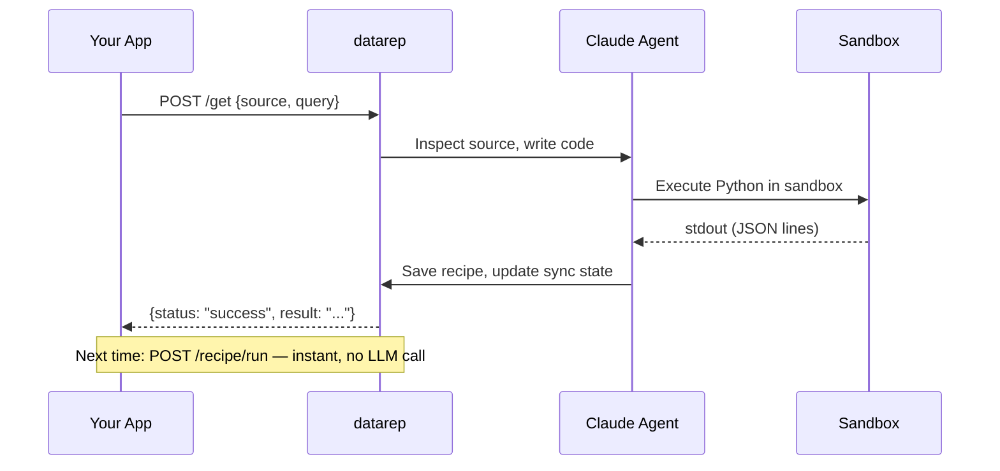

# datarep

**Delegated data retrieval for agentic apps.**

datarep is a trusted local service that retrieves data from arbitrary sources on behalf of your application. Your app describes what data it wants — datarep figures out how to get it.

---

## Why datarep?

Every app that needs user data ends up building its own integrations — its own OAuth flows, its own credential storage, its own API wrappers. They break. They drift. They each need their own security review.

datarep replaces all of that with a single trusted runtime:

- **Your app never writes retrieval code.** It sends a natural-language query. datarep's agent inspects the source, writes Python code, and executes it in a sandbox.
- **Your app never handles credentials.** datarep manages encrypted storage, browser-based OAuth, and automatic token refresh.
- **Your app never executes untrusted code.** All code runs inside datarep's sandbox with network and filesystem restrictions.
- **Users grant trust once** — to datarep — instead of to every app that wants their data.

## Install

=== "pip"

    ```bash
    pip install datarep
    ```

=== "curl"

    ```bash
    curl -sSL https://datarep-ai.github.io/datarep-docs/install.sh | sh
    ```

## Quick start

```bash
# Initialize datarep
datarep init

# Set your Anthropic API key (powers the retrieval agent)
export ANTHROPIC_API_KEY="sk-ant-..."

# Start the server
datarep start

# Register your app
datarep app register my-app
# => App ID:  app_...
# => API Key: dr_...  (save this)
```

Then retrieve data:

```bash
curl -X POST http://127.0.0.1:7080/get \
  -H "Authorization: Bearer dr_<your-api-key>" \
  -H "Content-Type: application/json" \
  -d '{"source": "my_source", "query": "get recent records"}'
```

datarep inspects the source, writes retrieval code, executes it, returns data, and saves a **recipe** — a cached version of the working code — so subsequent requests are instant.

## How it works



## Interfaces

| Interface | Use case |
|-----------|----------|
| **HTTP API** (`localhost:7080`) | Primary interface for all apps. Bearer token auth. |
| **MCP server** | Native protocol for LLM-powered / agentic apps. |
| **CLI** (`datarep`) | Setup, source management, debugging. |

## Source types

| Type | Example | Sandbox restrictions |
|------|---------|---------------------|
| `local_db` | iMessage, WhatsApp, any SQLite | No network. Read-only DB access. |
| `rest_api` | Square, Gmail, Quickbooks | Network restricted to source domain only. |
| `local_files` | Photos, documents, exports | No network. Read-only directory access. |

## Next steps

Read the **[Integration Guide](integration-guide.md)** for the full walkthrough: API reference, authentication, handling permissions, MCP setup, recipes, and code examples.
