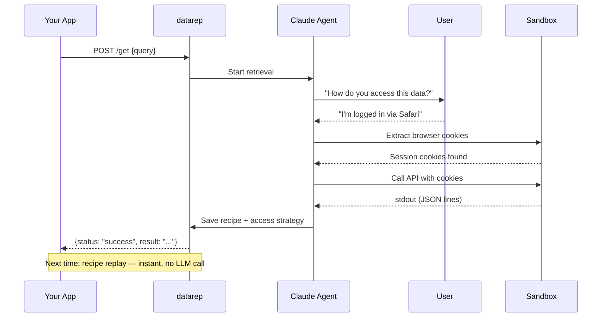

# datarep

**Your app's data rep.**

A **rep** is someone you send to go get something on your behalf. You don't tell them how — you tell them what you need, and they figure it out. They show up, assess the situation, adapt to whatever they find, and come back with the goods.

That's what datarep does. Your app says "get me the user's Instagram DMs" and datarep handles it — asks the user how they access the data, extracts session cookies from their browser, calls the API, parses the response, and delivers structured data. No one wrote an Instagram integration. The rep figured one out at runtime.

And like a good rep, it learns. Working code is saved as **recipes** with a full access strategy, so next time it doesn't have to figure it out again. First request takes seconds. Every request after that is instant.

---

## Why datarep?

Every app that needs user data today has to build and maintain its own integrations — or depend on a cloud service that proxies the user's data through someone else's servers. datarep is a different approach: a local agent runtime that synthesizes integrations on demand, runs on the user's machine, and never sends their data anywhere.

There isn't really a category for this yet. It's not a connector (those are pre-built by humans), not an ETL pipeline, not an SDK. It's an autonomous agent that *becomes* a connector — for any source, on the fly.

datarep replaces bespoke integration code with a single trusted runtime:

- **Your app never writes retrieval code.** It sends a natural-language query. datarep's agent discovers how to access the data and writes the extraction code at runtime.
- **Your app never handles credentials.** datarep extracts session cookies from the user's browsers, manages encrypted storage, handles OAuth, and refreshes tokens automatically.
- **Your app never executes untrusted code.** All code runs inside datarep's sandbox with filesystem and network restrictions.
- **Users grant trust once** — to datarep — instead of to every app that wants their data.

## Install

=== "pip"

    ```bash
    pip install datarep
    ```

=== "curl"

    ```bash
    curl -sSL https://datarep-ai.github.io/datarep-docs/install.sh | sh
    ```

## Quick start

```bash
# Initialize datarep
datarep init

# Set your Anthropic API key (powers the retrieval agent)
export ANTHROPIC_API_KEY="sk-ant-..."

# Start the server
datarep start

# Register your app
datarep app register my-app
# => App ID:  app_...
# => API Key: dr_...  (save this)
```

Then retrieve data:

```bash
curl -X POST http://127.0.0.1:7080/get \
  -H "Authorization: Bearer dr_<your-api-key>" \
  -H "Content-Type: application/json" \
  -d '{"query": "get my recent iMessages"}'
```

datarep's agent asks the user how they access the data, explores the device, writes retrieval code, executes it, returns data, and saves a **recipe** — a cached version of the working code — so subsequent requests are instant.

## How it works



## Interfaces

| Interface | Use case |
|-----------|----------|
| **HTTP API** (`localhost:7080`) | Primary interface for all apps. Bearer token auth. Supports conversational sessions. |
| **MCP server** | Native protocol for LLM-powered / agentic apps. |
| **CLI** (`datarep`) | Interactive retrieval, setup, source management, debugging. |

## Next steps

Read the **[Integration Guide](integration-guide.md)** for the full walkthrough: API reference, conversational sessions, authentication, MCP setup, recipes, and code examples.
